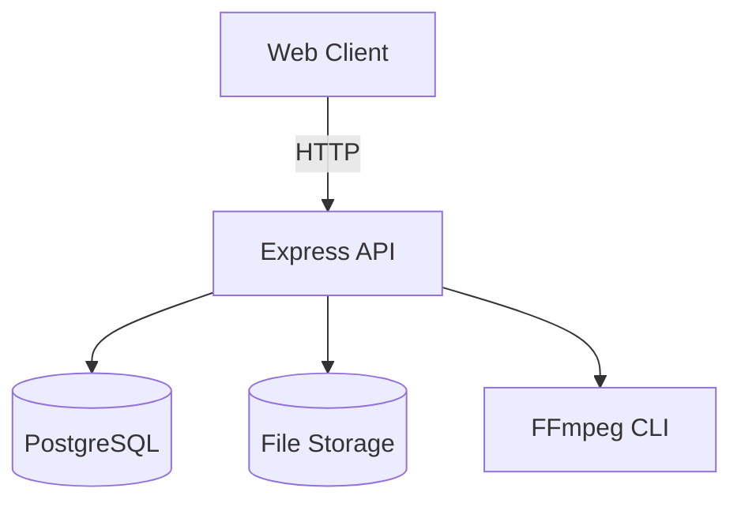

# Architecture (explication simple)

## Le schéma

## Explication en mots simples
- Le **Client** est le navigateur (frontend).
- L’**API** est le serveur Node/Express.
- **PostgreSQL** stocke les informations (titres, sourates, stats…).
- **Storage** contient les fichiers audio.
- **FFmpeg** ajoute la basmala et convertit les audios.

## Résultat attendu
Chaque partie a un rôle clair, ce qui rend le système stable et facile à maintenir.
